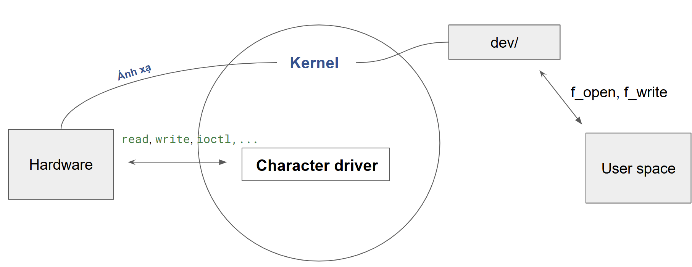
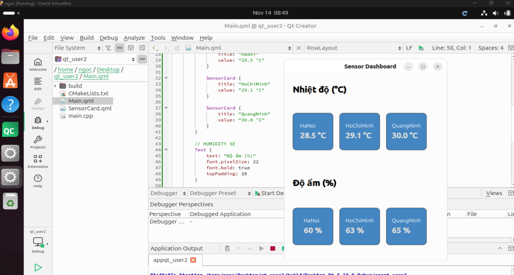

MỤC LỤC
```
|PHẦN   | NỘI DUNG
-----------------------------
|01     | GIỚI THIỆU
|02     | CÀI OS
```


## PHẦN 01: GIỚI THIỆU

Thông số kĩ thuật của RASPI 3B
Hình ảnh: <br>

Thông số: <br>


Pinout của RASPI 3B <br>


Tính năng <br>
```cpp
- Broadcom BCM2837 64bit ARM Cortex-A53 Quad Core - Processor SoC chạy ở @ 1.2GHz
- 1 GB RAM
- 4 x Cổng USB2.0 hỗ trợ dòng điện ra đến 1.2A
- 40-chân GPIO có thể mở rộng
- Xuất Video/Audio thông qua cổng 3.5mm 4 cực, HDMI, CSI camera, or Raw LCD (DSI)
- Lưu trữ: MicroSD
- 10/100 Ethernet (RJ45)
- Onboard BCM43143 WiFi
- Bluetooth Low Energy (BLE) on board
- Low-Level Peripherals:
 + 27 x GPIO
 + UART
 + I2C bus
 + SPI bus với 2 chip
 + +3.3V
 + +5V
 + Ground
- Yêu cầu nguồn điện: 5V @ 2.4 A qua cổng MicroUSB
- Hỗ trợ Raspbian, Windows 10 IoT Core, OpenELEC, OSMC, Pidora, Arch Linux, RISC OS, và nhiều hơn thế nữa!
- Kích thước: 85mm x 56mm x 17mm
```

## PHẦN 02: CÀI OS CHO PI
### Cách 01:
```
Có màn hình
```
```
Nếu có màn hình thì mọi chuyện rất đơn giản
B1: Tải file image
B2: Install
```
### Cách 02:
```
Không có màn hình
```
```
Nếu không có màn hình thì theo hướng dẫn tại 2 video này là được:
Thiết bị cần:
+ USB TO TTL CH340
+ Config.txt
```
Video 1: https://youtu.be/G0X2rfaq2ac?si=KLWJzZsvNzv6CizV <br>
Video 2: https://youtu.be/3C7O6ABCVLo?si=fOzwM1jXLSyOi_dD 

## PHẦN 03: CMD cơ bản VIM
Setup
```cpp
sudo apt update
sudo apt-get install vim
```
```
Esc +
:wq: Lưu và thoát
:set number: Hiện dòng
:<LINE_NUMBER>: Con trỏ trỏ đến dòng <LINE_NUMBER>
```

## PHẦN 04: KERNEL MODULE BASIC
Thêm header
```cpp
sudo apt update
sudo apt install build-essential linux-headers-$(uname -r)
```

Module đầu tiên
```cpp
#include <linux/module.h>   
#include <linux/kernel.h>   
#include <linux/init.h>     

//(insmod)
static int __init hello_init(void) {
    printk(KERN_INFO "Hello, world!\n");
    return 0;
}

//(rmmod)
static void __exit hello_exit(void) {
    printk(KERN_INFO "Goodbye, world!\n");
}

module_init(hello_init);
module_exit(hello_exit);

// Infor
MODULE_LICENSE("GPL");
MODULE_AUTHOR("HOCCUNGET");
MODULE_DESCRIPTION("HELLO WORLD");

```

Build module
```cpp
obj-m += hello.o

all:
	make -C /lib/modules/$(shell uname -r)/build M=$(PWD) modules

clean:
	make -C /lib/modules/$(shell uname -r)/build M=$(PWD) clean
```

```cpp
sudo insmod hello.ko   : Nạp module
sudo rmmod hello       : Gỡ module
dmesg | tail           : Đọc Log
```

## PHẦN 05 CHARACTER DEVICE DRIVER

```
Dữ liệu được đọc tuần tự theo từng byte một (chuột, bàn phím, serial,…)
Ví dụ:
/dev/ttyS0 (serial port)
/dev/input/ (chuột, bàn phím)
```

Bản chất thì nó là
```
Cầu nối giữa hardware và user-space
Cung cấp giao diện file để ứng dụng(user space) truy cập thiết bị(hardware)
```

Các chương trình trên tầng user có thể truy cập vào thiết bị tương ứng với các file nằm trong thư mục /dev và thực hiện các system call thích hợp trên thiết bị, các lệnh này sau đó sẽ được chuyển tới driver đã được liên kết với device file của thiết bị đó.

Tóm lại là:
```
Viết một character device driver → xuất hiện file /dev/temp_sensor
```

Ví dụ thực tế
```
Bạn muốn đọc nhiệt độ bằng một phần cứng A qua I2C
```
```cpp
Viết một Character device driver
--> Khi đó sẽ xuất hiện /dev/temp_sensor

+ Driver mình viết: sẽ lo việc giao tiếp với phần cứng
+ App thì chỉ cần: int fd = open("/dev/temp_sensor", O_RDONLY);

```

Chốt lại
```
Một driver trong Linux kernel dùng để ánh xạ thiết bị (hardware/ảo) 
thành file trong /dev/, cho phép user-space giao tiếp với thiết 
bị bằng thao tác file (read/write)
```
### 5.1 Struct miscdevice
Mỗi device file (như /dev/tty0, /dev/sda,..) sẽ gắn với driver cụ thể trong kernel thông qua 
```
- Major Number
- Minor Number
```
Major Number = Số định danh driver
Minor Number = Phân biệt các thiết bị cụ thể

Ví dụ
```
Major 8 -> driver SCSI disk (/dev/sda, /dev/sdb…)

Driver SCSI Disk (major 8) quản lý nhiều ổ đĩa:

+ /dev/sda → minor 0
+ /dev/sdb → minor 16
+ /dev/sdc → minor 32
```

⚠️ Khi dùng Struct miscdevice
```
Major number chung cho misc devices (10)

+ Đăng ký minor number
+ Kernel tự tạo node /dev/<name>
```

```cpp
#include <linux/miscdevice.h>
struct miscdevice  {
	int minor; // MISC_DYNAMIC_MINOR -> Kernel tự động chọn minor ngẫu nhiên         
	const char *name; //name trong dev/name
	const struct file_operations *fops; //con trỏ đến các hàm xử lý sự kiện (open, read,..) 
	[....]
};
```
Code thực tế
```cpp
#include <linux/module.h>
#include <linux/init.h>
#include <linux/fs.h>
#include <linux/miscdevice.h>
#include <linux/gpio.h>
#include <linux/uaccess.h>


static ssize_t myled_write(struct file *filp, const char __user *buf,
                           size_t count, loff_t *f_pos)
{
    char val;
    if (copy_from_user(&val, buf, 1))
        return -EFAULT;

    pr_info("myled: LED set to %c\n", val);
    return count;
}

static const struct file_operations myled_fops = {
    .write = myled_write,
};

static struct miscdevice myled_device = {
    .minor = MISC_DYNAMIC_MINOR,
    .name = "myled",
    .fops = &myled_fops,
};

static int __init myled_init(void)
{

    int ret = misc_register(&myled_device);
    if (ret)
        pr_err("Failed to register misc device\n");
    else
        pr_info("Registered /dev/myled\n");
    return ret;
}

static void __exit myled_exit(void)
{
    misc_deregister(&myled_device);
    pr_info("Deregistered /dev/myled\n");
}

module_init(myled_init);
module_exit(myled_exit);

MODULE_LICENSE("GPL");

```

```cpp
obj-m += led_driver.o

all:
	make -C /lib/modules/$(shell uname -r)/build M=$(PWD) modules

clean:
	make -C /lib/modules/$(shell uname -r)/build M=$(PWD) clean
```

## PHẦN 06 GPIO

Thư viện truy cập trên user space
```
sudo apt update
sudo apt install gpiod libgpiod-dev

```

Cụ thể có thể viết function như sau
```cpp
#include <gpiod.h>
#include <stdio.h>
#include <unistd.h>

#define CONSUMER "MyApp"

int main(void)
{
    const char *chipname = "gpiochip0";
    unsigned int line_num = 17; 
    struct gpiod_chip *chip;
    struct gpiod_line *line;
    int ret;

    chip = gpiod_chip_open_by_name(chipname);
    if (!chip) {
        perror("Open chip failed");
        return 1;
    }

    line = gpiod_chip_get_line(chip, line_num);
    if (!line) {
        perror("Get line failed");
        gpiod_chip_close(chip);
        return 1;
    }

    ret = gpiod_line_request_output(line, CONSUMER, 0);
    if (ret < 0) {
        perror("Request line as output failed");
        gpiod_chip_close(chip);
        return 1;
    }

    while(1){
    printf("Turn LED ON\n");
    gpiod_line_set_value(line, 1);
    sleep(1);

    printf("Turn LED OFF\n");
    gpiod_line_set_value(line, 0);

    sleep(1);
    }

    gpiod_line_release(line);
    gpiod_chip_close(chip);
    return 0;
}

```

Build chương trình
```cpp
gcc -o main blinkled.c -lgpiod
```
## PHẦN 07 I2C

```cpp
#include <stdio.h>
#include <stdlib.h>
#include <stdint.h>
#include <fcntl.h>
#include <unistd.h>
#include <sys/ioctl.h>
#include <linux/i2c-dev.h>

#define DS3231_ADDR 0x68

// BCD to Dec
int bcd_to_dec(uint8_t val) {
    return ((val / 16 * 10) + (val % 16));
}

int main() {
    int fd;
    char *filename = "/dev/i2c-1";

    // Open I2C bus
    if ((fd = open(filename, O_RDWR)) < 0) {
        perror("Cant open /dev/i2c-1");
        exit(1);
    }

    // Choose device
    if (ioctl(fd, I2C_SLAVE, DS3231_ADDR) < 0) {
        perror("Không chọn được DS3231");
        exit(1);
    }

    // Address start (0x00)
    uint8_t reg = 0x00;
    write(fd, &reg, 1);

    uint8_t data[7];
    if (read(fd, data, 7) != 7) {
        perror("Err read DS3231");
        exit(1);
    }

    int second = bcd_to_dec(data[0] & 0x7F);
    int minute = bcd_to_dec(data[1]);
    int hour   = bcd_to_dec(data[2] & 0x3F);
    int day    = bcd_to_dec(data[4]);
    int month  = bcd_to_dec(data[5] & 0x1F);
    int year   = bcd_to_dec(data[6]) + 2000;

    printf("Time: %02d:%02d:%02d %02d/%02d/%d\n",
           hour, minute, second, day, month, year);

    close(fd);
    return 0;
}

```
## PHẦN 08 QT DESIGN

### 8.1 BUTTON - CONSOLE.LOG
```cpp
Button {
    text: "Click Me"
    anchors.centerIn: parent
    onClicked: {
        console.log("Button clicked!")
    }
}
```
### 8.2 INPUT - CHANGEEDIT
```cpp

ApplicationWindow {
    visible: true
    width: 400
    height: 200
    title: "Input & Button"

    Column {
        anchors.centerIn: parent
        spacing: 20

        Text {
            text: "Nhập tên của bạn:"
            font.pixelSize: 16
        }

      
        TextInput {
            id: nameInput
            width: 200
            height: 30
            font.pixelSize: 16
            placeholderText: "Nhập tên"
            focus: true
            selectByMouse: true
            Rectangle { anchors.fill: parent; color: "#f0f0f0"; radius: 5 } 
        }


        Button {
            text: "Đăng ký"
            onClicked: {
                console.log("Tên bạn vừa nhập: " + nameInput.text)
                resultText.text = "Bạn vừa nhập: " + nameInput.text
            }
        }

     
        Text {
            id: resultText
            text: ""
            font.pixelSize: 16
            color: "blue"
        }
    }
}
```
### 8.3 Rectangle
```cpp
ApplicationWindow {
    visible: true
    width: 400
    height: 300
    title: "Rectangle Demo"

    Rectangle {
        width: 200
        height: 100
        color: "lightblue"
        radius: 10         
        border.color: "blue"
        border.width: 2
        anchors.centerIn: parent

        Text {
            anchors.centerIn: parent
            text: "Hello Rectangle"
            font.pixelSize: 16
            color: "white"
        }
    }
}
```

SẢN PHẨM CUỐI KHÓA 





```cpp
import QtQuick 2.15
import QtQuick.Controls 2.15
import QtQuick.Layouts 1.15
ApplicationWindow {
    visible: true
    width: 400
    height: 500
    title: "Sensor Dashboard"

    ColumnLayout {
        anchors.fill: parent
        anchors.margins: 20
        spacing: 20

        // TEMPERATURE 
        Text {
            text: "Nhiệt độ (°C)"
            font.pixelSize: 22
            font.bold: true
        }

        RowLayout {
            spacing: 15

            SensorCard {
                title: "Sensor 1"
                value: "28.5 °C"
            }

            SensorCard {
                title: "Sensor 2"
                value: "29.1 °C"
            }

            SensorCard {
                title: "Sensor 3"
                value: "30.0 °C"
            }
        }

        // HUMIDITY SE
        Text {
            text: "Độ ẩm (%)"
            font.pixelSize: 22
            font.bold: true
            topPadding: 20
        }

        RowLayout {
            spacing: 15

            SensorCard {
                title: "Sensor 1"
                value: "60 %"
            }

            SensorCard {
                title: "Sensor 2"
                value: "63 %"
            }

            SensorCard {
                title: "Sensor 3"
                value: "65 %"
            }
        }
    }
}


// Component 


import QtQuick 2.15
import QtQuick.Controls 2.15

Rectangle {
    id: root
    width: 100
    height: 100
    radius: 10
    color: "#2D2F31"
    border.color: "#555"
    border.width: 1

    property string title: ""
    property string value: ""

    Column {
        anchors.centerIn: parent
        spacing: 6

        Text {
            text: root.title
            font.pixelSize: 14
            color: "white"
        }

        Text {
            text: root.value
            font.pixelSize: 20
            font.bold: true
            color: "#00E6B8"
        }
    }
}

```


