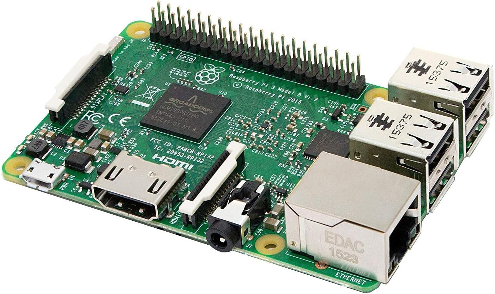
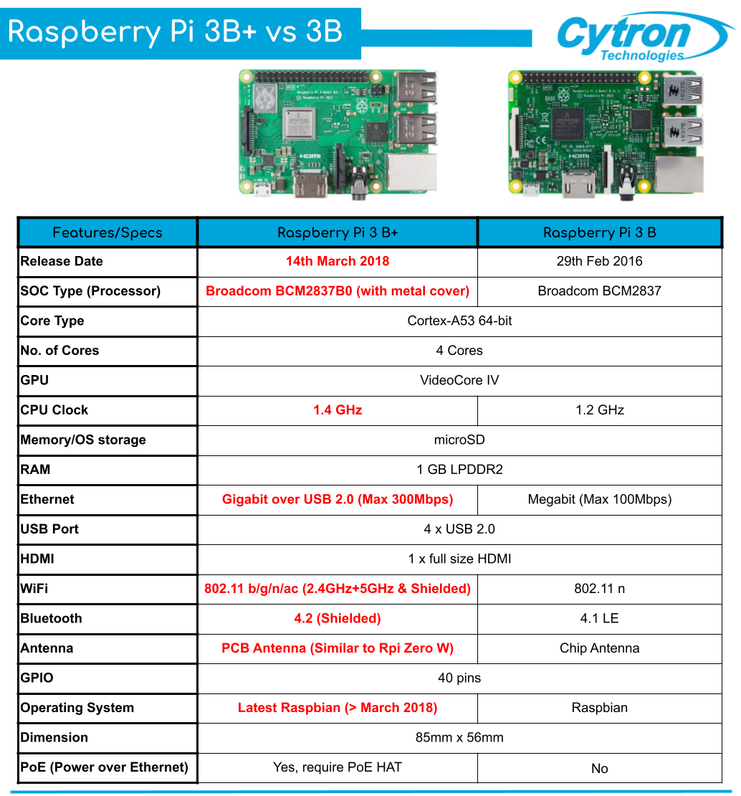
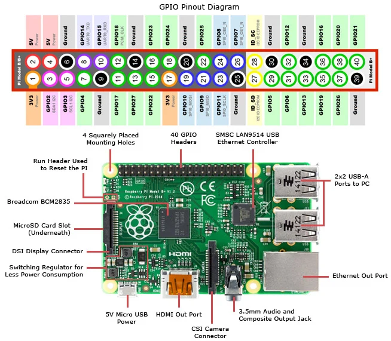

MỤC LỤC
```
|PHẦN   | NỘI DUNG
-----------------------------
|01     | GIỚI THIỆU
|02     | CÀI OS
```


## PHẦN 01: GIỚI THIỆU

Thông số kĩ thuật của RASPI 3B
Hình ảnh: <br>

Thông số: <br>


Pinout của RASPI 3B <br>


Tính năng <br>
```cpp
- Broadcom BCM2837 64bit ARM Cortex-A53 Quad Core - Processor SoC chạy ở @ 1.2GHz
- 1 GB RAM
- 4 x Cổng USB2.0 hỗ trợ dòng điện ra đến 1.2A
- 40-chân GPIO có thể mở rộng
- Xuất Video/Audio thông qua cổng 3.5mm 4 cực, HDMI, CSI camera, or Raw LCD (DSI)
- Lưu trữ: MicroSD
- 10/100 Ethernet (RJ45)
- Onboard BCM43143 WiFi
- Bluetooth Low Energy (BLE) on board
- Low-Level Peripherals:
 + 27 x GPIO
 + UART
 + I2C bus
 + SPI bus với 2 chip
 + +3.3V
 + +5V
 + Ground
- Yêu cầu nguồn điện: 5V @ 2.4 A qua cổng MicroUSB
- Hỗ trợ Raspbian, Windows 10 IoT Core, OpenELEC, OSMC, Pidora, Arch Linux, RISC OS, và nhiều hơn thế nữa!
- Kích thước: 85mm x 56mm x 17mm
```

## PHẦN 02: CÀI OS CHO PI
### Cách 01:
```
Có màn hình
```
```
Nếu có màn hình thì mọi chuyện rất đơn giản
B1: Tải file image
B2: Install
```
### Cách 02:
```
Không có màn hình
```
```
Nếu không có màn hình thì theo hướng dẫn tại 2 video này là được:
Thiết bị cần:
+ USB TO TTL CH340
+ Config.txt
```
Video 1: https://youtu.be/G0X2rfaq2ac?si=KLWJzZsvNzv6CizV <br>
Video 2: https://youtu.be/3C7O6ABCVLo?si=fOzwM1jXLSyOi_dD 

## PHẦN 03: 